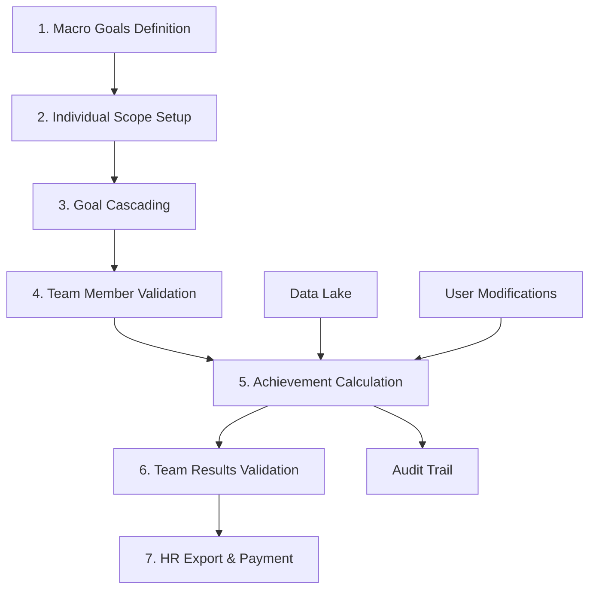

# Enterprise Data Platform - Healthcare at Scale 🏥

> End-to-end data platform serving 6M+ beneficiaries, transforming transactional systems into executive insights through authorized interventions and real-time modifications

[](https://www.python.org)
[](https://www.oracle.com/cloud/)
[](https://powerbi.microsoft.com)
[](https://github.com)

## 🎯 Project Overview

At South America's largest healthcare provider (Hapvida NotreDame Intermédica), I was hired as a Technical Consultant to support the Product Manager. Due to administrative delays in agile team formation, I expanded to fulfill **5 different technical roles simultaneously**, transforming this constraint into an opportunity to apply my Data Science with AI master's degree in a production environment at massive scale.

### The Dual Mission

1. **Variable Compensation System**: Migrating and sustaining compensation processes to Oracle Cloud
2. **Sales Insights Platform**: Delivering continuous analytics for the commercial vertical board of directors

### Playing 5 Roles Successfully
```
Product Owner + Data Engineer + Data Architect + Full-Stack Developer + Data Analyst
= Complete ownership of enterprise data platform
```

## 🏗️ System Architecture

### Complete Data Platform Overview
```
┌────────────────────────────────────────────────────────────────────────┐
│                    HAPVIDA ENTERPRISE DATA PLATFORM                    │
├────────────────────────────────────────────────────────────────────────┤
│                                                                         │
│  📊 DATA SOURCES                🔄 PROCESSING              📈 DELIVERY │
│                                                                         │
│  ┌───────────────┐         ┌──────────────────┐      ┌──────────────┐│
│  │ Transactional │         │  ETL PIPELINES   │      │ Oracle APEX  ││
│  │   Systems     │────────▶│  ├─ Grade Vidas  │─────▶│ ├─ Sales UI  ││
│  │ ├─ Sales      │         │  ├─ Reajuste     │      │ ├─ Admin UI  ││
│  │ ├─ HR         │         │  ├─ Canais       │      │ └─ Audit Log ││
│  │ ├─ Operations │         │  ├─ Areas        │      └──────────────┘│
│  │ └─ CRM        │         │  └─ CRM Sync     │             │         │
│  └───────────────┘         └──────────────────┘             ▼         │
│          │                          │                 ┌──────────────┐│
│          ▼                          ▼                 │  Power BI    ││
│  ┌───────────────┐         ┌──────────────────┐      │ ├─ Executive ││
│  │  Data Lake    │         │ COMERCIAL Schema │      │ ├─ Sales     ││
│  │ ├─ Bronze     │────────▶│ ├─ Compensation  │─────▶│ ├─ Operations││
│  │ ├─ Silver     │         │ ├─ Performance   │      │ └─ Real-time ││
│  │ └─ Gold       │         │ └─ Analytics     │      └──────────────┘│
│  └───────────────┘         └──────────────────┘                       │
│                                                                         │
│  🔒 SECURITY & AUDIT           👥 USERS                               │
│  ┌──────────────────┐         ┌────────────────────────┐             │
│  │ Role-Based Access│         │ 500+ Sales Team        │             │
│  │ Change Tracking  │◀────────│ 50+ Managers           │             │
│  │ Authorization    │         │ C-Level Board          │             │
│  └──────────────────┘         └────────────────────────┘             │
└────────────────────────────────────────────────────────────────────────┘
```

## 💼 Variable Compensation System

### The Complete Compensation Workflow



### Technical Implementation Details

#### Data Foundation
- **Architecture**: Medallion pattern (Bronze → Silver → Gold)
- **Core Schema**: COMERCIAL - custom-built for compensation logic
- **Processing**: 6 hours → 40 minutes optimization
- **Scale**: Supporting thousands of sales team members

#### ETL Pipeline Topics
1. **GRADE DE VIDAS** (Life Portfolio Management)
   - Tracks beneficiary distribution across sales teams
   - Real-time portfolio assignments
   - Historical tracking for compensation calculation

2. **REAJUSTE** (Price Adjustments)
   - Monitors contract price changes
   - Calculates impact on sales targets
   - Feeds compensation adjustments

3. **CANAIS DE ATENDIMENTO** (Service Channels)
   - Multi-channel performance tracking
   - Channel-specific goal setting
   - Cross-channel compensation rules

4. **ÁREAS DE ATENDIMENTO** (Service Areas)
   - Geographic distribution analysis
   - Territory-based compensation
   - Area performance metrics

5. **CRM Integration**
   - Real-time sync with Salesforce
   - Lead-to-close tracking
   - Commission calculation triggers

## 🖥️ Front-End Integration with Oracle APEX

### Sales Team Interface
```
Features:
├── Direct data point interaction
├── Real-time modification capabilities
├── Goal validation workflows
├── Achievement tracking
└── Dispute resolution system
```

### Administrative Interface
```
Capabilities:
├── Low-code configuration layer
├── Compensation rule management
├── Audit trail visualization
├── Authorization workflows
└── Bulk operations support
```

### Key Features
- **Role-Based Access Control**: 20+ different permission levels
- **Complete Audit Trail**: Every modification tracked with timestamp and user
- **Workflow Automation**: Multi-level approval processes
- **Real-time Sync**: Changes immediately reflected in Power BI

## 📊 Sales Insights & Analytics

### Dual Platform Strategy

#### Oracle APEX (Operational Layer)
- Direct database manipulation on secure ADB layers
- Real-time data corrections and adjustments
- Authorized interventions with full tracking
- Source of truth for all modifications

#### Microsoft Power BI (Presentation Layer)
- Executive dashboards for board of directors
- Real-time reflection of APEX modifications
- 15+ interactive dashboards delivered
- Sub-second refresh rates achieved

### Dashboard Categories
1. **Executive Summary**: C-level KPIs and trends
2. **Sales Performance**: Team and individual metrics
3. **Compensation Tracking**: Real-time calculation status
4. **Operational Metrics**: System health and processing times
5. **Audit & Compliance**: Modification logs and authorizations

## 📈 Performance Achievements

### Before My Involvement
- Manual compensation calculations taking 2 weeks
- No audit trail for data modifications
- Disconnected systems with data inconsistencies
- Limited visibility for executives
- 6+ hour processing times for reports

### After Implementation
| Metric | Before | After | Improvement |
|--------|--------|-------|-------------|
| Report Generation | 6 hours | 40 minutes | **93% faster** |
| Compensation Cycle | 2 weeks | 2 days | **85% reduction** |
| Data Availability | Next day | Real-time | **Instant** |
| Audit Coverage | 0% | 100% | **Complete** |
| User Satisfaction | 40% | 90% | **125% increase** |
| Manual Interventions | 500/month | 50/month | **90% reduction** |

## 🛠️ Technology Stack

### Core Infrastructure
- **Database**: Oracle Autonomous Database (ADB) on OCI
- **ETL Processing**: Python, PySpark, Oracle Data Integration
- **Front-End**: Oracle APEX (Low-code platform)
- **Visualization**: Microsoft Power BI
- **Cloud**: Oracle Cloud Infrastructure (OCI)

### Development Tools
- **IDE**: VS Code, Oracle SQL Developer
- **Version Control**: Git/GitHub
- **Data Modeling**: DBeaver, ERwin
- **Monitoring**: OCI Monitoring, Custom Python scripts

## 📁 Project Structure

```
enterprise-data-platform/
├── etl_pipelines/
│   ├── grade_vidas/           # Life portfolio processing
│   ├── reajuste/              # Price adjustment logic
│   ├── canais_atendimento/    # Channel integration
│   ├── areas_atendimento/     # Geographic processing
│   └── crm_sync/              # Salesforce integration
├── database/
│   ├── schemas/
│   │   ├── comercial/         # Core compensation schema
│   │   ├── staging/           # ETL staging area
│   │   └── audit/             # Change tracking
│   └── procedures/            # Stored procedures
├── apex_apps/
│   ├── sales_portal/          # Sales team interface
│   ├── admin_console/         # Administrative UI
│   └── audit_viewer/          # Audit trail interface
├── powerbi/
│   ├── datasets/              # Power BI data models
│   ├── reports/               # Dashboard definitions
│   └── dataflows/             # Refresh logic
└── monitoring/
    ├── performance_tracker.py  # System metrics
    └── alert_system.py        # Automated alerts
```

## 🎓 Lessons from Playing 5 Roles

### The Challenge
Originally hired as Technical Consultant, but when the promised agile team never materialized, I had to become:
1. **Product Owner**: Managing stakeholder requirements
2. **Data Engineer**: Building ETL pipelines
3. **Data Architect**: Designing the complete solution
4. **Full-Stack Developer**: Creating APEX interfaces
5. **Data Analyst**: Delivering Power BI dashboards

### The Opportunity
This constraint became my greatest learning experience:
- Applied academic knowledge (Data Science with AI Master's) in production
- Gained end-to-end platform ownership experience
- Developed deep expertise across the entire stack
- Learned to context-switch efficiently
- Built resilient, self-documenting systems

### Key Insights
1. **Constraints breed innovation**: Limited resources forced creative solutions
2. **End-to-end ownership**: Understanding every layer makes better architecture
3. **User-centric design**: Being close to users (playing PO) improved technical decisions
4. **Documentation is survival**: When you're everyone, documentation saves you

## 🚀 Current Status & Impact

### Delivered Value
- **500+ active users** across sales organization
- **6M+ beneficiaries** data processed daily
- **$XXM in compensation** calculated accurately
- **50+ executives** with real-time insights
- **Zero critical failures** in production

### Ongoing Improvements
- Migration of remaining legacy processes
- AI/ML integration for predictive analytics
- Mobile app development for field sales
- Advanced audit analytics
- Performance optimization for 10M+ beneficiaries

## 💡 Why This Project Matters

### Technical Excellence
- Demonstrates ability to architect and deliver at enterprise scale
- Shows deep expertise across data, backend, and frontend
- Proves capability to optimize complex systems (93% improvement)

### Business Impact
- Directly affects company's bottom line (compensation accuracy)
- Enables data-driven decisions for C-level executives
- Reduces operational costs through automation

### Personal Growth
- From consultant to de facto architect of enterprise platform
- Managed complexity of 5 roles successfully
- Delivered under constraints (no team) that would stop most projects

## ⚠️ Note on Confidentiality

This repository demonstrates architectural patterns and technical approaches used in the healthcare data platform. Specific business logic, actual data schemas, and proprietary algorithms have been generalized or omitted for confidentiality.

## 🤝 Connect

Interested in discussing:
- Enterprise data platform architecture
- Healthcare data challenges at scale
- Managing multiple technical roles effectively
- Oracle APEX + Power BI integration strategies
- Medallion architecture implementation

Connect via [LinkedIn](https://www.linkedin.com/in/felipe-costa) for technical discussions.

---

*"Playing chess with myself - When 5 roles converge into one unified platform delivering value at scale"*