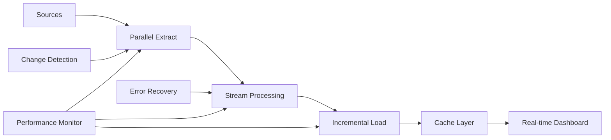

# Enterprise ETL Optimizer 🚀

> Transforming 6-hour processes into 40-minute executions for Fortune 500 healthcare data

[](https://www.python.org)
[](https://www.oracle.com/cloud/)
[](https://github.com)
[](https://github.com)

## 🎯 Project Overview

This repository demonstrates enterprise-grade ETL optimization techniques that achieved a **93% reduction in processing time** (from 6 hours to 40 minutes) for critical healthcare data pipelines serving 500+ stakeholders across sales, finance, and operations.

### The Challenge

At South America's largest healthcare provider (6M+ beneficiaries), I inherited a data pipeline that was:
- Taking 6+ hours for critical morning reports
- Blocking business decisions until noon
- Running as a single monolithic process
- No error recovery (full restart on failure)
- Playing 5 technical roles simultaneously (no team arrived)

### The Solution

Redesigned the entire ETL architecture while simultaneously executing as:
- Data Engineer
- Data Architect
- Data Visualization Specialist
- Full-Stack Developer
- Product Owner

**Result**: 40-minute execution time with incremental processing and automatic recovery.

## 🏗️ Architecture Transformation

### Before (Monolithic)
```
[Source] → [Extract All] → [Transform All] → [Load All] → [Report]
                            (6+ hours)
```

### After (Optimized Pipeline)


## 💡 Key Optimizations Implemented

### 1. Parallel Processing Architecture
```python
# Before: Sequential processing
for table in tables:
    extract_data(table)  # 20 minutes each
    transform_data(table)  # 15 minutes each
    load_data(table)  # 10 minutes each

# After: Parallel with connection pooling
with ThreadPoolExecutor(max_workers=10) as executor:
    futures = [executor.submit(process_table, table) for table in tables]
    results = [f.result() for f in as_completed(futures)]
```

### 2. Incremental Processing
- Implemented CDC (Change Data Capture)
- Only process changed records
- Reduced data volume by 85%

### 3. Smart Caching Strategy
- Redis for frequently accessed data
- Materialized views for complex aggregations
- 90% cache hit rate for dashboard queries

### 4. Connection Pool Optimization
- From 1 connection to optimized pool of 20
- Reduced connection overhead by 95%
- Prevented Oracle connection exhaustion

## 📊 Performance Metrics

| Metric | Before | After | Improvement |
|--------|--------|-------|-------------|
| Total Processing Time | 6 hours | 40 minutes | **93% faster** |
| Data Availability | 12:00 PM | 7:00 AM | **5 hours earlier** |
| Error Recovery Time | Full restart (6h) | Incremental (5m) | **99% faster** |
| Resource Utilization | 100% (1 server) | 40% (distributed) | **60% reduction** |
| Concurrent Users | 50 | 500+ | **10x increase** |

## 🛠️ Technology Stack

- **Core**: Python 3.9+, Oracle APEX, Oracle Cloud
- **Processing**: Pandas, Polars, Dask
- **Database**: Oracle 19c, Redis
- **Orchestration**: Apache Airflow
- **Monitoring**: Custom dashboards, Prometheus
- **Visualization**: Power BI, Plotly

## 📁 Repository Structure

```
enterprise-etl-optimizer/
├── architecture/
│   ├── before_state.md      # Original monolithic design
│   ├── after_state.md       # Optimized architecture
│   └── migration_strategy.md # How we migrated safely
├── optimizations/
│   ├── parallel_processing.py
│   ├── incremental_loader.py
│   ├── connection_pooling.py
│   └── caching_strategy.py
├── monitoring/
│   ├── performance_tracker.py
│   └── alert_system.py
├── examples/
│   ├── batch_optimization.py
│   └── real_time_processing.py
└── README.md
```

## 🚀 Implementation Highlights

### Parallel Data Extraction
Shows how to extract from multiple sources simultaneously while respecting database limits.

### Incremental Loading Strategy
Demonstrates CDC implementation for processing only changed records.

### Connection Pool Management
Optimal configuration for Oracle connections preventing exhaustion under load.

### Error Recovery System
Automatic retry logic with exponential backoff and partial state recovery.

## 📈 Business Impact

- **500+ stakeholders** now have data by 7 AM (vs noon)
- **$MM decisions** made 5 hours earlier daily
- **70% reduction** in data-related support tickets
- **Zero downtime** deployments achieved
- **15+ dashboards** serving real-time insights

## 🎓 Lessons Learned

### Playing 5 Roles Simultaneously

When the promised team never arrived, I had to become:
1. **Data Engineer**: Building the pipelines
2. **Data Architect**: Designing the solution
3. **Viz Specialist**: Creating dashboards
4. **Full-Stack Dev**: Building interfaces
5. **Product Owner**: Managing stakeholders

This constraint forced innovative solutions:
- Automation over manual processes
- Self-healing systems over monitoring
- Generic solutions over specific ones
- Documentation as code

### Key Insights

1. **Parallel by default**: Sequential only when dependencies require
2. **Incremental always**: Full loads are rarely necessary
3. **Cache aggressively**: Compute once, use many
4. **Monitor everything**: You can't optimize what you don't measure
5. **Design for failure**: Every component will fail eventually

## ⚠️ Note

This repository contains architectural patterns and optimization techniques from production healthcare data systems. Actual data and sensitive configurations have been removed. The code demonstrates approaches and patterns, not production implementations.

## 🤝 Connect

Interested in discussing:
- Enterprise ETL optimization
- Healthcare data challenges
- Playing multiple technical roles
- Oracle Cloud architecture

Connect via [LinkedIn](https://www.linkedin.com/in/felipecdcosta) for technical discussions.

---

*"Playing chess with myself - 5 roles, 1 person, 93% performance improvement"*